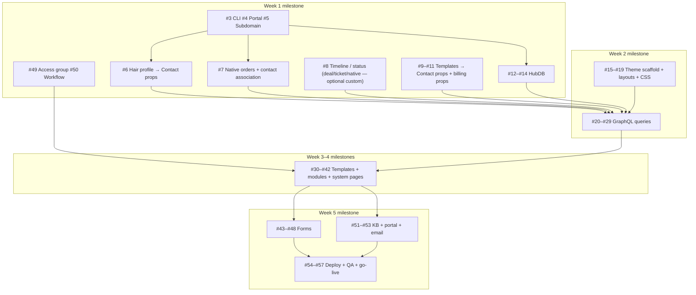

# Customer Portal 2.0 — Subagent Implementation Plan

This document ties **`master-plan`** (architecture + file layout) to **GitHub Issues [#3–#57](https://github.com/hairsolutionsco/customer-portal/issues)** and defines how to execute with a **team of parallel subagents** without duplicating work or breaking HubSpot constraints.

**Canonical references (read first):** **`AGENT_PROMPT.md`** (full file-level technical spec for HubL, GraphQL, schemas, modules) · `master-plan` · HubSpot [recruiting-agency-graphql-theme](https://github.com/HubSpot/recruiting-agency-graphql-theme) · local issue snapshot: `exports/github-issues.json`

**Contract:** Orchestration lives in this file; **how to build each file** lives in `AGENT_PROMPT.md` (including the execution-model table that maps sections → agents → issues).

---

## 1. North star and non-negotiables

| Principle | Implication for implementation |
|-----------|--------------------------------|
| **Membership + GraphQL** | Every contact-scoped query uses `request.contact.contact_vid` (or equivalent) as in recruiting-agency theme; templates declare `dataQueryPath` matching `src/data-queries/*.graphql`. |
| **Contact properties + native commerce first** | **Hair profile** and **saved templates** are **Contact properties**, not custom objects. **Orders** and **invoices** use HubSpot’s **native** Commerce CRM objects. **Custom objects are optional** — HubSpot documents CMS use of custom objects as **Content Hub Enterprise**; the theme **must compile and upload** with GraphQL stubs / contact-only queries when custom objects are absent. **Order status history** is **not** gated on a custom order object: use native order fields, **deals**, **tickets**, or workflows. HubDB (#12–14) runs after **target portal** is connected (#3–#4). Sandbox **recommended** — see **`HANDOFF_PROMPT.md`**. |
| **Single theme upload surface** | All code lives under one CLI theme path (e.g. `src/` → **`hs cms upload`** or legacy **`hs upload`** per #54); naming matches `master-plan` tree (`hair-solutions-portal/` logical root). |
| **Writes via HubSpot Forms** | No bespoke POST from HubL; forms (#43–48) embed with `` per Phase 5 in `master-plan`. |
| **Access group** | `/portal/*` and KB/support surfaces align with **Portal Customers** (#49–50, Phase 6–7 in `master-plan`). |

---

## 2. Dependency graph (execution order)

Edges are **hard blockers** (must finish A before B).



**Efficiency note:** **#6**, **#7**, **#9–#11**, and **#12–#14** can run in parallel once the portal exists; **#8** can overlap **#7** if it uses deals/tickets rather than a custom object. Document **GraphQL explorer** results for `order` / invoices on membership pages in **`SCHEMA_REGISTRY.md`** before trusting order-detail queries.

---

## 3. Subagent roster (roles)

Each role is a **stable persona** you assign to a subagent. Give each agent: repo path, `master-plan` section, issue numbers, and **done definition**.

| Agent | Scope | Primary issues | Outputs / artifacts |
|-------|--------|----------------|---------------------|
| **A0 — Platform bootstrap** | CLI, portal target (#3–#4), subdomain (#5), gitignore for optional local `hubspot.config.yml` | #3, #4, #5 | `hs` working (`hs accounts list`); auth via **`~/.hscli/config.yml`** and/or local gitignored config; portal chosen (sandbox **or** production per handoff); DNS/subdomain plan for memberships documented |
| **A1 — CRM configuration** | Contact property groups (hair profile, templates, billing flags), native **order** / **invoices** setup + associations; optional `schemas/*.json` only if needed outside CMS | #6–#11 | `SCHEMA_REGISTRY.md` filled: property internal names, HubDB IDs, native object FQNs; GraphQL notes for order/invoice vs mirror strategy |
| **A2 — HubDB** | Table definitions + seed JSON under `hubdb/` | #12–#14 | Three tables; published rows or import-ready seed |
| **A3 — Membership & access** | Access group, page gates, registration workflow | #49, #50 | `is_portal_customer` (or agreed flag), gated `/portal/*`, workflows documented |
| **A4 — Theme scaffold** | `theme.json`, `fields.json`, folder skeleton, `base.html` / `portal.html`, CSS variables | #15–#19 | Compilable empty theme uploaded once for smoke test |
| **A5 — GraphQL (CRM)** | Contact-scoped queries | #20–#26, #29 | Valid `.graphql` files; variables documented in comments |
| **A6 — GraphQL (HubDB)** | `products`, `locations` | #27–#28 | HubDB table IDs / names aligned with portal |
| **A7 — Global chrome** | Sidebar + header modules | #30–#31 | Modules + nav map for all portal routes |
| **A8 — Dashboard & orders** | Dashboard template + modules; orders list; **dynamic** order detail | #32–#34, #42 (partial) | `portal-order-detail` dynamic slug pattern per issue #22 body |
| **A9 — Profile & customization** | Profile page + customization grid | #35–#36 | Forms linked as placeholders until #43–#44 |
| **A10 — Commerce & billing** | Invoices, shop, billing | #37, #40–#41 | Billing uses `billing.graphql` + HubDB plans |
| **A11 — Locations & settings** | Locations + settings | #38–#39 | Settings aligns with `settings.graphql` |
| **A12 — System & auth UI** | Membership system templates branding | #42 | System CSS + 404/500 |
| **A13 — Forms** | HubSpot UI forms + embed IDs documented in modules | #43–#48 | Form GUIDs in module fields or theme docs |
| **A14 — Service Hub** | KB, customer portal, email | #51–#53 | Categories, article migration plan, notifications |
| **A15 — Release engineering** | Upload, pages, QA, go-live | #54–#57 | Page tree `/portal/...`, publish checklist, monitoring |

**Shared utilities (pick one owner to avoid duplication):** **`status-badge.module`** and enum mapping for order/invoice states — implement early inside **A8** or a tiny **A4.5** spike once **#6–#10** enums are frozen.

---

## 4. Waves: parallel bundles and handoffs

### Wave 0 — Bootstrap (sequential start, then parallel)

1. **Single agent A0** completes #3 → #4 → #5 (subdomain may wait on DNS; do not block schema file authoring in repo). **#4** means “development portal” — use a HubSpot sandbox if the account has one; otherwise the primary portal with the discipline described in **`HANDOFF_PROMPT.md`**.
2. **Parallel:** A1 starts #6 (independent); A1 prepares #7; A2 starts #12–#14 once the **target portal** is connected (#3) and you are ready to create HubDB there.

**Handoff:** `SCHEMA_REGISTRY.md` (optional, repo-local) listing: object type IDs, association type names, HubDB table IDs — **required before A5/A6 run GraphQL**.

### Wave 1 — CRM + HubDB (parallel with light constraints)

- **A1:** #6–#11 interpreted as **contact properties + native commerce** (not mandatory custom-object creation). If GitHub issue text still says “custom object,” follow **`AGENT_PROMPT.md` §1** and this plan’s north star. **#8** is flexible: deal/ticket/native order timeline — not blocked on custom `order` schema.
- **A2:** #12–#14 (parallel among themselves).

**Handoff:** GraphQL association labels in queries must match **generated** portal naming (recruiting-agency pattern); verify in HubSpot GraphQL explorer before merging.

### Wave 2 — Membership (can overlap late Wave 1)

- **A3:** #49, #50 — coordinate with A0 subdomain (#5).

**Handoff:** Document which pages are gated and which system templates are assigned.

### Wave 3 — Theme + GraphQL (high parallelism)

- **A4:** #15–#19 (mostly sequential within A4).
- **After** A4 has `layouts/portal.html` stub and `data-queries/` folder:
  - **A5** and **A6** run **in parallel** (#20–#29).

**Verification gate (blocking):** Each query runs in CMS GraphQL tool with a **test contact** that has associated orders/profile data (seed or manual).

### Wave 4 — UI build (maximum parallelization)

After **all** P3 queries validate:

| Parallel track | Issues | Notes |
|----------------|--------|--------|
| Track 1 | A7 #30–#31 | Global modules first — **other agents depend on nav**. |
| Track 2 | A8 #32–#34 | May start after Track 1 **or** use static nav mock until #30 lands. |
| Track 3 | A9 #35–#36 | |
| Track 4 | A10 #37, #40–#41 | |
| Track 5 | A11 #38–#39 | |
| Track 6 | A12 #42 | System templates can parallel with page templates if CSS tokens from #19 exist. |

**Merge order suggestion:** #30–#31 → #32–#35 → order detail #34 → remaining pages → #42.

### Wave 5 — Forms + Service + Release

- **A13** #43–#48 (parallel per form once target objects/properties exist).
- **A14** #51–#53 (parallel where independent; KB content migration can be longest pole).
- **A15** #54–#57 strictly after theme + pages stable in the **target** portal (sandbox or controlled production).

---

## 5. Issue-to-master-plan traceability (quick matrix)

| Phase | Issues | `master-plan` anchor |
|-------|--------|----------------------|
| P0 | #3–#5 | Phase 0 table |
| P1 | #6–#14 | § Phase 1 schemas + HubDB |
| P2 | #15–#19 | § Phase 2 theme tree |
| P3 | #20–#29 | § Phase 3 queries (include `order_status_history` inside order detail per #22) |
| P4 | #30–#42 | § Phase 4 templates/modules/system |
| P5 | #43–#48 | § Phase 5 forms table |
| P6 | #49–#50 | § Phase 6 memberships |
| P7 | #51–#53 | § Phase 7 native services (+ email #53) |
| P8 | #54–#57 | § Phase 8 deploy + QA |

---

## 6. Subagent prompt template (copy per spawn)

Use this verbatim shell for each subagent; replace placeholders.

```text
You are Agent {{AGENT_ID}} ({{ROLE_NAME}}) for hairsolutionsco/customer-portal.

Read-only context:
- Repository: 00-engineering/apps/customer-portal (HubSpot CMS theme + schemas)
- Architecture: file `master-plan` (sections for Phase {{PHASE}})
- GitHub Issues (acceptance criteria + steps): {{ISSUE_LIST}} — close by matching AC in issue body.

Rules:
- Follow HubSpot CMS GraphQL + membership patterns from recruiting-agency-graphql-theme.
- Do not print secrets; hubspot.config.yml must stay gitignored.
- Output: PR-sized commits; list files touched; note any new HubSpot UI steps for Vincent.

Done when:
- {{DONE_CRITERIA}}
- Issue AC checklists satisfied (update issue via gh if requested).
- **Task completion ritual executed** — see §6a (git push + HubSpot upload + issues export).
```

---

## 6a. Task completion ritual (automatic after every task / wave)

**Treat this as part of “done”** — not optional documentation.

| Order | Step | How |
|-------|------|-----|
| 1 | **Refresh issue exports** | `npm run portal:issues` or `./scripts/sync-github-exports.sh` → updates `exports/github-issues.json` and `exports/github-milestones.json`. |
| 2 | **Upload theme to Design Manager** | From `hair-solutions-portal/`: **`hs cms upload src hair-solutions-portal`** or **`hs upload src hair-solutions-portal`** (CLI default account in **`~/.hscli/config.yml`**; optional local `hubspot.config.yml` gitignored). |
| 3 | **Push git** | Commit all changes (including refreshed exports) and `git push` to `origin`. |

**Single command (preferred):** from `customer-portal/`:

```bash
./scripts/portal_task_complete.sh "chore(portal): short description of the completed task"
```

Flags / env: `--skip-hubspot`, `--skip-git`, `--issues-only`; `SKIP_HUBSPOT=1`, `SKIP_GIT=1`, `SKIP_ISSUES=1`, `HUBSPOT_THEME_DEST` (default `hair-solutions-portal`), `GITHUB_REPO` (default: `gh repo view`).

Orchestrators and solo agents run this after **each** merged PR slice, **each** wave, or **each** GitHub issue closed — whichever granularity matches the work batch.

---

## 7. Quality gates (efficient, precise)

| Gate | When | Check |
|------|------|--------|
| **G1 CRM** | After #6–#11 | Contact properties visible; native orders/invoices (or documented mirror) associated to test contact; optional custom objects not required |
| **G2 HubDB** | After #12–#14 | Rows queryable; columns match `master-plan` |
| **G3 GraphQL** | After #20–#29 | Every query executes against **target portal** data (seeded or manual); no null blowups on empty associations |
| **G4 Theme compile** | After #19 | `hs upload` succeeds (or full **§6a** `portal_task_complete.sh`) |
| **G5 Membership** | After #49–#50 | Logged-out user cannot read `/portal` content; logged-in portal customer can |
| **G6 Forms** | After #43–#48 | Each submission creates/updates correct object or ticket |
| **G7 Release** | After #56–#57 | Page list matches `master-plan` Phase 8 routes; DNS + monitoring documented |

---

## 8. Risks and mitigations

| Risk | Mitigation |
|------|------------|
| Association / GraphQL names drift from HubSpot generator | A1 maintains **registry**; A5/A6 re-query introspection or UI after each schema change |
| Orders/invoices not in membership GraphQL schema | Document in **SCHEMA_REGISTRY**; implement **Deal + line_item** or **workflow → Contact** mirror; keep stubs until path is known |
| Dynamic order page slug mismatch | Lock **#22** variable contract (`request.path_param_dict.dynamic_slug` + `order_number`) before #34 |
| Membership subdomain delays #5 | Proceed on target portal; defer production DNS to #57 |
| Module duplication (badges, cards) | Single owner for **status-badge** + shared CSS in `css/components/` |
| KB migration (#51) exceeds Week 5 | A14 timeboxes P0 articles; backlog rest |

---

## 9. Orchestrator (you) — weekly checklist

1. After **every** task batch / wave / PR: run **`./scripts/portal_task_complete.sh "message"`** (or perform the same three steps manually: issues export → `hs upload` → git push). See **§6a**.
2. Run **one wave** of implementation; merge **global nav (#30–#31)** before wide page parallelization.
3. After each wave: **G* gate** + short note on `SCHEMA_REGISTRY.md` if IDs changed.
4. Keep **A1 ↔ A5** coupling tight (schema changes = GraphQL diff same PR or linked PR).
5. On GitHub: close issues or tick checklists when AC are met **before** refreshing exports so `exports/github-issues.json` reflects reality.

---

## 10. Milestone alignment (GitHub)

| Milestone | Due (from issues) | Issue count focus |
|-----------|-------------------|-------------------|
| Week 1: Setup + Schemas + Memberships | 2026-04-13 | #3–#14, #49–#50 |
| Week 2: Theme + GraphQL | 2026-04-20 | #15–#29 |
| Week 3: Core pages | 2026-04-27 | #30–#36, #42 |
| Week 4: Remaining pages | 2026-05-04 | #37–#41 |
| Week 5: Forms + Services + Deploy | 2026-05-11 | #43–#57 |

This plan is **optimized for parallel subagents**: clear ownership, minimal blocking edges, explicit handoffs, and direct mapping from **`master-plan`** to **every issue**.
